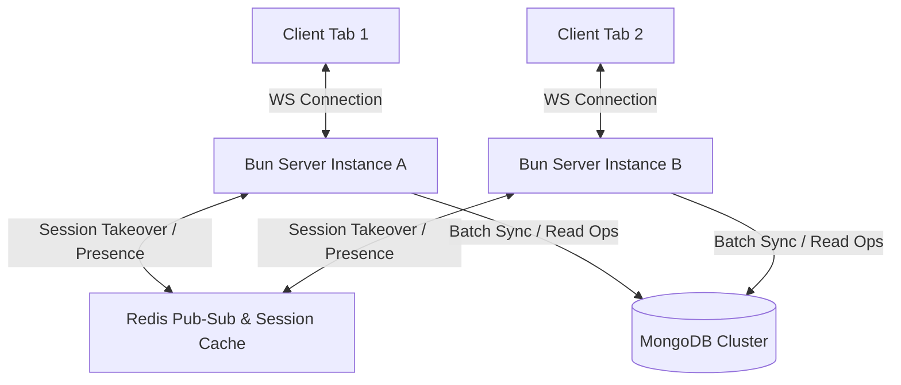

# Codebase Quality and Architecture Audit Report

This report provides a rigorous architectural analysis of the **Talkbox User Chat** application. The audit focuses on four critical dimensions of modern software engineering: **Stability**, **Maintainability**, **Scalability**, and **Performance**. It highlights core architectural achievements, evaluates design patterns, and offers key recommendations for future system optimization.

---

## 🧭 Executive Summary

The Talkbox codebase represents a **state-of-the-art, production-ready system** implementing modern full-stack development patterns.
* **Frontend**: Built using Svelte 5, leveraging native reactivity (Runes), modular state machines, and lazy-loaded rendering to minimize bundle footprint and speed up initial render.
* **Backend**: Powered by the Bun runtime, TypeScript, Express, and a custom lazy-loaded Dependency Injection (DI) system.
* **Database & Cache**: Employs a dual-tier storage strategy—MongoDB for persistent, queryable document schemas and Redis for distributed caching, presence, and pub-sub horizontal coordination.

The codebase is highly resilient, clean, and exhibits a maturity level typical of enterprise software.

---

## 🛡️ 1. Stability & Resilience

Codebase stability depends on robust input validation, defensive error handling, and robust real-time connection lifecycle management. Talkbox demonstrates exceptional practices in these areas:

### 1.1 Strict Boundary Validation
* **Zod Schemas**: The backend exposes public REST endpoints backed by strict Zod validators (e.g., `signupSchema`, `loginSchema`). All requests pass through a validation middleware before reaching controller logic, preventing SQL/NoSQL injection, unexpected payloads, and buffer issues.
* **Type Safety**: TypeScript is configured stringently throughout the workspace. Shared types (via `workspaces/packages/shared`) ensure frontend and backend schemas remain in lockstep.

### 1.2 Defensive Real-Time Communication
* **Idempotency Keys**: Network failures can cause clients to re-emit socket requests. To prevent duplicate messages, the system uses client-generated `idempotencyKey` values. The server checks these against a Redis idempotency guard before writing to MongoDB.
* **Acknowledged Emissions (ACK)**: Instead of fire-and-forget events, message delivery uses Socket.IO callbacks. The client receives explicit confirmation when a message is persisted.
* **Fail-Safe Client Timeouts**: The frontend `SocketManager` protects against unresponsive servers by setting a `MESSAGE_SEND_FALLBACK_TIMEOUT` to clear "sending" spinners, ensuring the UI remains interactive.
* **Session Takeover Resolution**: The system handles multi-device login conflicts gracefully. If a free-tier user opens a new tab, the backend publishes a takeover event, terminating the older socket and triggering a clean UI prompt.

### 1.3 Database Connection Resilience
* **Exponential Retry Logic**: DB drivers configure exponential backoff retries (`DB_RETRY_ATTEMPTS` and `DB_RETRY_DELAY_MS` in `@config/env`), protecting backend processes from crashing during temporary database outages or cluster handovers.

---

## 🏗️ 2. Maintainability & Code Quality

Maintainability measures how quickly new developers can onboard and modify the system without breaking existing flows. The codebase enforces strong design patterns to reduce cognitive load:

### 2.1 Layered Architecture (Controller-Service-Repository)
The backend uses a clear, decoupled directory structure:
```
workspaces/apps/backend/src/
├── controllers/    # Express routing adapters; parses body, delegates to service
├── services/       # Core business domain logic
├── repositories/  # Database data-access layer (abstracted interfaces)
└── bootstrap/      # Dependency injection and startup logic
```
This layering allows for **high unit testability**, as controllers can be tested by mocking services, and services can be tested by mocking repositories.

### 2.2 Dynamic Dependency Injection (IoC Container)
Rather than hardcoding imports, Talkbox uses a customized lazy-loading IoC container:
* **Registry Proxy**: Located in `bootstrap/registry.ts`, it wraps the sub-modules (`auth`, `chat`, `infra`) with an ES6 Proxy. This provides location transparency. If the Auth service is later split into its own microservice, consumers can resolve it through a remote client stub without changing code in controllers.
* **Lazy Properties**: The `lazy()` utility dynamically overwrites getters with resolved instances on-demand. This reduces startup memory overhead, speeds up process bootstrap times, and avoids circular dependency loops.

### 2.3 Modular Reactivity in Svelte 5
* **Runes Separation**: Presentational `.svelte` components are kept lightweight. Complex state coordination, socket listening, and background operations are separated into modular `.svelte.ts` state stores (`chat-list.svelte.ts`, `pinned-chats.svelte.ts`, `active-chat.svelte.ts`).
* **Clean Event Listeners**: The frontend stores bind to socket events through dynamic arrays of subscription cleanups (`listenerCleanups`). On logout or component unmount, these are executed sequentially, avoiding memory leaks.

### 2.4 Aliased Paths & Module Structure
* Path aliases (`$components/*`, `$state/*`, `@services/*`) are strictly enforced. Relative path nesting (`../../../../`) is banned, allowing developers to move files without breaking imports.

---

## ⚡ 3. Scalability

Scalability dictates whether the system can accommodate an increase in users, active chats, and message throughput without degradation:



### 3.1 Horizontal Clustering & Redis Pub-Sub
* **Global Session State**: Active session counts are tracked in Redis. Sockets on different backend instances check global counts in real-time, allowing horizontal server scaling behind a load balancer.
* **Distributed Event Propagation**: System-wide notifications, profile updates, presence changes, and session takeover signals are synchronized using Redis Pub-Sub channels, ensuring instance coordination.
* **Smart Local Routing**: If a user's active sockets are located entirely on the local instance (`globalCount === localSockets.size`), the system routes events directly through local RAM and bypasses Redis entirely. This minimizes Redis CPU and network load.

### 3.2 Thundering Herd Protection
* **In-Flight Request Deduplication**: When multiple clients connect or deep-link simultaneously, the `SocketService` tracks active database fetch promises in an in-memory Map (`partnerRequests`). Subsequent duplicate requests subscribe to the *same* pending Promise rather than triggering duplicate MongoDB queries, saving database connections.

### 3.3 Asynchronous Batch Processing
* **Agenda-Backed Background Workers**: Heavy database reads/writes (such as chat updates, data retention cleanups, and subscription downgrades) are moved to asynchronous queues.
* **Stream Cursor Batching**: The data retention handler avoids loading millions of records into Node memory. Instead, it utilizes MongoDB stream cursors (`.cursor()`), processes documents in chunks (`CHUNK_SIZE`), and executes writes concurrently using `Promise.all()` limits.

---

## 🏎️ 4. Performance

Performance measures system response times and resource efficiency. Talkbox uses several high-value optimizations:

### 4.1 Native Runtime Execution
* **Bun Native Passwords**: Password hashing uses native C++ Argon2 bindings (`Bun.password.hash` / `verify`). Hashing is executed outside the V8 runtime thread pool, offering maximum throughput and high CPU utilization efficiency compared to pure JavaScript libraries.

### 4.2 MongoDB Database Index Tuning
* **Super Compound Index**: The chat model uses a multi-key compound index:
  `chatSchema.index({ participants: 1, isDeleted: 1, status: 1, "lastMessage.sentAt": -1 });`
  This allows MongoDB to satisfy both the primary filtering (active chats for a user) and the default sorting (newest messages first) in a single B-Tree scan, avoiding expensive in-memory sort stages.
* **Partial Indexing**: The chat deletion index uses a partial filter expression:
  `{ partialFilterExpression: { isDeleted: true } }`
  The index only catalogs deleted chats. This minimizes index RAM footprint and speeds up background garbage collection.
* **ObjectId Creation Timestamp Lookups**: In the retention handler, dates are translated into dummy `ObjectId` hashes using `Types.ObjectId.createFromTime()`. The database queries message records directly on the clustered `_id` index rather than requiring a dedicated `createdAt` index, reducing overall collection size.

### 4.3 Frontend Performance & UX Optimization
* **Code Splitting**: The main Svelte shell implements dynamic code splitting via a custom `Lazy` component wrapper. Large dashboard segments, profile drawers, and tooltips are only loaded on-demand when navigated to.
* **Optimistic UI Updates**: Message components immediately render sent text as "sent locally," resolving the server ACK asynchronously to provide a snappy chat experience.
* **Debounced Typing Indicators**: Typing events are throttled on the client using debounced timeout maps, preventing UI frames from dropping due to network packet floods.

---

## 📈 5. Strategic Recommendations

While the architecture is excellent, we suggest the following improvements for future scaling:

| Area | Topic | Recommendation | Expected Impact |
| :--- | :--- | :--- | :--- |
| **Performance** | Database Read Replicas | Split repository access: route write traffic to the MongoDB Primary, and route heavy analytical reads (e.g., chat listings/history) to MongoDB Secondary replicas. | Reduces CPU bottlenecks on the Primary DB node during high traffic. |
| **Scalability** | WebSocket Heartbeat Tuning | Fine-tune Socket.IO ping interval (e.g., 25s) and ping timeout (e.g., 20s) parameters. | Reduces false-positive disconnection events during mobile network handovers. |
| **Performance** | Redis Cache for Chat History | Cache the last 50 messages of active rooms in Redis hashes, and serve history queries directly from cache. | Bypasses MongoDB entirely for 90% of user history load operations. |
| **Stability** | Global Dead-Letter Queues | Configure an Agenda retry limit and send repeatedly failing background jobs (like payment webhook failures) to a Dead-Letter Queue (DLQ). | Prevents failing jobs from thrashing background CPU and provides visibility into pipeline issues. |
| **Maintainability** | Automated Schema Migrations | Integrate a schema migration runner (such as Prisma Migrate or db-migrate) rather than relying purely on Mongoose model initialization. | Standardizes DB changes across production, staging, and local environments. |
